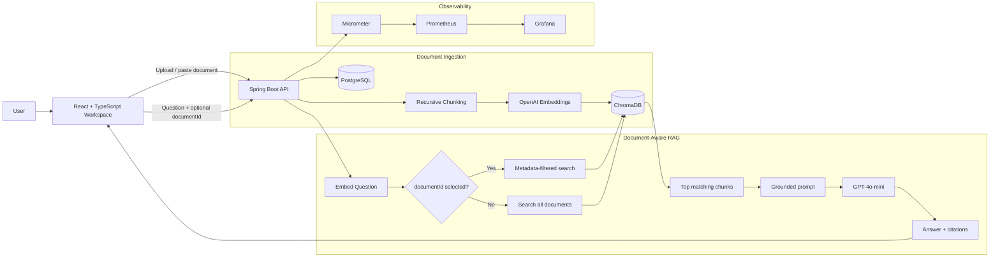
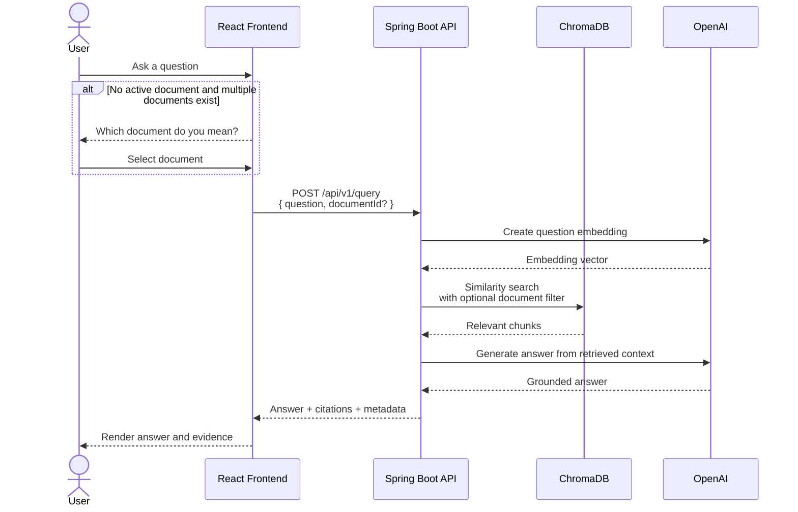

<div align="center">

# 🔍 DocuQuery

### Ask technical documents questions - and trace every answer back to its source!

A full-stack Retrieval-Augmented Generation workspace built with **React, TypeScript, Spring Boot, ChromaDB, PostgreSQL, OpenAI, Docker, Prometheus, and Grafana**.

[Demo](#-demo) · [Features](#-features) · [Quick Start](#-quick-start) · [API](#-api-reference)

<br />


</div>

---

## ✨ What makes DocuQuery different?

Most document chat demos search everything at once and return a blended answer.

DocuQuery adds **document-aware retrieval**:

- Upload and index multiple technical documents
- Ask questions in a conversational workspace
- Select an active document when a question is ambiguous
- Restrict retrieval to the selected document
- Inspect citations and supporting passages
- Trace answers back to retrieved evidence
- Monitor latency, errors, and service health

The result is a more reliable RAG experience for overlapping documents, repositories, and system guides.

---

## 🎬 Demo

<p align="center">
  <a href="https://drive.google.com/file/d/1OeTDW4mcnfuETuSQ3dMDMHyTvZwymkSu/view?usp=sharing">
    
  </a>
</p>

<p align="center">
  <strong>▶ Watch the 2-minute product walkthrough</strong>
</p>

### Suggested demo flow

1. Upload two documents with overlapping topics
2. Ask an ambiguous question such as **“What is the system architecture?”**
3. Select the intended document from the clarification prompt
4. Show the scoped answer and citations
5. Open **Trace Answer** to inspect supporting evidence
6. Ask a second question and switch documents

---

## 🚀 Features

### Document workspace

- Upload Markdown, text, or JSON documents
- Paste document content directly
- View indexed documents in a persistent library
- Select, switch, and delete documents
- Track document titles and chunk counts

### Conversational querying

- Ask natural-language questions
- Collapse the question composer after submission
- Expand it again to ask another question
- Preserve the conversation flow
- Render structured Markdown answers

### Multi-document disambiguation

When multiple documents could answer the same question, DocuQuery asks the user which document they mean.

```text
User: What is the system architecture?

DocuQuery:
I found multiple indexed documents.
Which one are you referring to?

[ AtlasFlow ]  [ OrbitOps ]
```

The selected `documentId` is sent with the original question, and ChromaDB retrieval is filtered to that document.

### Grounded answers

- Semantic retrieval over document chunks
- Prompt-constrained generation
- Source-aware citations
- Supporting evidence panel
- Answer tracing
- No answer fabrication when context is insufficient

### Production-style observability

- Query latency metrics
- P50, P95, and P99 tracking
- Query and error counters
- Prometheus scraping
- Grafana dashboards
- PostgreSQL and ChromaDB health checks

---

## 🏗️ Architecture


```mermaid
flowchart LR
    User["User"] --> UI["React + TypeScript Workspace"]

    UI -->|"Upload / paste document"| API["Spring Boot API"]
    UI -->|"Question + optional documentId"| API

    subgraph Ingestion["Document Ingestion"]
        API --> Chunk["Recursive Chunking"]
        Chunk --> Embed["OpenAI Embeddings"]
        Embed --> Vector[("ChromaDB")]
        API --> Metadata[("PostgreSQL")]
    end

    subgraph Retrieval["Document-Aware RAG"]
        API --> QEmbed["Embed Question"]
        QEmbed --> Filter{"documentId selected?"}
        Filter -->|"Yes"| Scoped["Metadata-filtered search"]
        Filter -->|"No"| Global["Search all documents"]
        Scoped --> Vector
        Global --> Vector
        Vector --> Context["Top matching chunks"]
        Context --> Prompt["Grounded prompt"]
        Prompt --> LLM["GPT-4o-mini"]
        LLM --> Answer["Answer + citations"]
    end

    Answer --> UI

    subgraph Observability["Observability"]
        API --> Metrics["Micrometer"]
        Metrics --> Prometheus["Prometheus"]
        Prometheus --> Grafana["Grafana"]
    end
```

---

## 🔄 Query flow


```mermaid
sequenceDiagram
    actor U as User
    participant F as React Frontend
    participant A as Spring Boot API
    participant V as ChromaDB
    participant L as OpenAI

    U->>F: Ask a question

    alt No active document and multiple documents exist
        F-->>U: Which document do you mean?
        U->>F: Select document
    end

    F->>A: POST /api/v1/query<br/>{ question, documentId? }
    A->>L: Create question embedding
    L-->>A: Embedding vector

    A->>V: Similarity search<br/>with optional document filter
    V-->>A: Relevant chunks

    A->>L: Generate answer from retrieved context
    L-->>A: Grounded answer
    A-->>F: Answer + citations + metadata
    F-->>U: Render answer and evidence
```

---

## 🧠 RAG pipeline

### Ingestion

```text
Document
  → validate
  → split into overlapping chunks
  → generate embeddings
  → store vectors in ChromaDB
  → store document metadata in PostgreSQL
```

### Query

```text
Question
  → optional document selection
  → generate question embedding
  → semantic search
  → filter by documentId when selected
  → assemble retrieved context
  → generate grounded answer
  → return citations and retrieval metadata
```

---

## 🛠️ Tech stack

| Layer | Technology | Responsibility |
|---|---|---|
| Frontend | React, TypeScript, Vite, Tailwind CSS | Document workspace, chat flow, citations, evidence UI |
| API | Java 17, Spring Boot 3.5 | Ingestion, retrieval orchestration, query APIs |
| Vector store | ChromaDB | Embedding storage and semantic search |
| Metadata | PostgreSQL 16 | Document metadata and persistence |
| Embeddings | OpenAI `text-embedding-3-small` | Vector representation of documents and questions |
| Generation | OpenAI `gpt-4o-mini` | Context-grounded answers |
| Metrics | Micrometer, Prometheus | Latency, throughput, and error metrics |
| Dashboards | Grafana | Operational visualization |
| Runtime | Docker, Docker Compose | Local multi-service orchestration |

---

## ⚡ Quick start

### Prerequisites

- Docker Desktop
- Node.js 20+
- An OpenAI API key

### 1. Clone the repository

```bash
git clone https://github.com/gauri2029/docuquery.git
cd docuquery
```

### 2. Configure the API key

```bash
export OPENAI_API_KEY=your-key-here
```

Or place it in a local `.env` file that is excluded from Git.

### 3. Start the backend stack

```bash
docker compose up --build
```

Services:

| Service | URL |
|---|---|
| API | `http://localhost:8080` |
| ChromaDB | `http://localhost:8000` |
| Prometheus | `http://localhost:9090` |
| Grafana | `http://localhost:3000` |

### 4. Start the frontend

```bash
cd frontend
npm install
npm run dev
```

Open:

```text
http://localhost:5173
```

---

## 📡 API reference

### Ingest a document

```http
POST /api/v1/documents/ingest
```

```json
{
  "title": "OrbitOps",
  "content": "# OrbitOps\nA cloud-native incident response platform..."
}
```

### List documents

```http
GET /api/v1/documents
```

### Delete a document

```http
DELETE /api/v1/documents/{id}
```

### Query all documents

```http
POST /api/v1/query
```

```json
{
  "question": "What is the deployment architecture?"
}
```

### Query one selected document

```http
POST /api/v1/query
```

```json
{
  "question": "What is the deployment architecture?",
  "documentId": 2
}
```

`documentId` is optional, so existing unfiltered queries remain backward-compatible.

### Health check

```http
GET /api/v1/health
```

### Prometheus metrics

```http
GET /actuator/prometheus
```

---

## 📊 Observability

DocuQuery records production-style metrics for the query path.

| Metric | Description |
|---|---|
| `docuquery.query.latency` | End-to-end query latency with percentiles |
| `docuquery.query.total` | Total completed queries |
| `docuquery.query.errors` | Failed queries |

The system exposes metrics through Spring Boot Actuator, Prometheus collects them, and Grafana provides dashboards for operational analysis.

---

## 📁 Project structure

```text
docuquery/
├── frontend/
│   ├── src/
│   │   ├── api/                  # Typed API client
│   │   ├── components/           # Workspace, query, answer and evidence UI
│   │   ├── hooks/                # Health and document hooks
│   │   └── types/                # Frontend API types
│   └── README.md
├── infra/
│   └── prometheus/
├── src/main/java/com/docuquery/docuquery/
│   ├── controller/               # Document, query and health endpoints
│   ├── service/                  # Chunking, embeddings, retrieval and LLM
│   ├── model/                    # Persistence models
│   └── repository/               # PostgreSQL repositories
├── src/main/resources/
│   └── application.yml
├── docker-compose.yml
├── Dockerfile
└── README.md
```

---

## 🎯 Design decisions

| Decision | Why |
|---|---|
| Spring Boot instead of a Python-only RAG stack | Demonstrates production Java backend engineering alongside AI integration |
| Document-scoped retrieval | Prevents overlapping documents from being blended into confusing answers |
| Optional `documentId` | Adds precise filtering without breaking existing API clients |
| ChromaDB | Self-hosted semantic search with straightforward metadata filtering |
| PostgreSQL | Reliable document metadata persistence |
| Prompt-constrained generation | Keeps responses grounded in retrieved text |
| Evidence-first UI | Makes answers easier to verify instead of presenting opaque AI output |
| Docker Compose | Runs the complete local stack consistently |

---

## 🧪 Useful demo questions

With two architecture documents indexed:

```text
What is the system architecture?
```

DocuQuery should ask which document the user means.

Then try:

```text
How does OrbitOps continue operating when search is unavailable?
```

```text
What authentication methods does AtlasFlow support?
```

```text
What testing strategy is used?
```

```text
Which information is not available in this document?
```

---

## 🗺️ Roadmap

- Streaming responses with Server-Sent Events
- Background ingestion for large documents
- Hybrid keyword and vector search
- Redis query caching
- Automated RAG evaluation
- Conversation persistence
- Additional file formats
- Authentication and workspaces
- Cloud deployment

---

## 📄 License

Released under the [MIT License](LICENSE).

---

<div align="center">

Built to make technical documentation easier to explore — without losing the evidence behind the answer.

</div>
