# 🔍 DocuQuery

**AI-powered technical documentation assistant** - Ask questions about your docs in plain English, get accurate answers with source citations.

> *"How do I set up the local dev environment?"* → Gets you a precise, cited answer in under a second.

[](https://openjdk.org/)
[](https://spring.io/projects/spring-boot)
[](https://docs.docker.com/compose/)
[](https://openai.com/)

---

## 🏗️ Architecture

```mermaid
graph TB
    Client["🖥️ Client (curl / Postman)"] --> API["⚙️ Spring Boot API :8080"]
    
    subgraph "Ingestion Pipeline"
        API -->|"POST /ingest"| Chunk["📄 Chunking Service"]
        Chunk --> Embed["🔢 OpenAI Embeddings"]
        Embed --> ChromaDB[("🔍 ChromaDB :8000")]
        Embed --> Postgres[("🗄️ PostgreSQL :5555")]
    end
    
    subgraph "Query Pipeline"
        API -->|"POST /query"| EmbedQ["🔢 Embed Question"]
        EmbedQ --> Search["🔍 Semantic Search"]
        ChromaDB -.-> Search
        Search --> Prompt["📝 Prompt Assembly"]
        Prompt --> LLM["🤖 GPT-4o-mini"]
        LLM --> Answer["✅ Cited Answer"]
    end
    
    subgraph "Observability"
        API -.-> Metrics["📊 Micrometer"]
        Metrics --> Prometheus["📈 Prometheus :9090"]
        Prometheus --> Grafana["📉 Grafana :3000"]
    end

    style API fill:#6366f1,stroke:#4f46e5,color:#fff
    style ChromaDB fill:#10b981,stroke:#059669,color:#fff
    style Postgres fill:#3b82f6,stroke:#2563eb,color:#fff
    style LLM fill:#f59e0b,stroke:#d97706,color:#fff
    style Prometheus fill:#ef4444,stroke:#dc2626,color:#fff
    style Grafana fill:#f97316,stroke:#ea580c,color:#fff
```



---

## ⚡ How It Works

### Ingestion
```
Document → Chunk (1000 chars, 200 overlap) → Embed via OpenAI → Store in ChromaDB + PostgreSQL
```
Upload any markdown or text document. DocuQuery splits it into overlapping chunks, generates vector embeddings using OpenAI's `text-embedding-3-small` model, and stores them in ChromaDB for fast semantic search. Document metadata is tracked in PostgreSQL.

### Query (RAG Pipeline)
```
Question → Embed → Semantic Search (top 5 chunks) → Prompt Assembly → LLM → Cited Answer
```
When you ask a question, DocuQuery embeds it using the same model, performs a semantic similarity search against all stored chunks, assembles a context-augmented prompt, and sends it to GPT-4o-mini. The LLM is instructed to answer **only** from the retrieved context and cite its sources.

---

## 🛠️ Tech Stack

| Layer | Technology | Purpose |
|---|---|---|
| **API** | Spring Boot 3 + Java 17 | REST endpoints, orchestration |
| **Vector Store** | ChromaDB | Semantic search over document embeddings |
| **Database** | PostgreSQL 16 | Document metadata and audit trail |
| **Embeddings** | OpenAI `text-embedding-3-small` | Convert text to vector representations |
| **LLM** | OpenAI `gpt-4o-mini` | Generate answers from retrieved context |
| **Metrics** | Micrometer + Prometheus | Query latency (P50/P95/P99), error rates |
| **Dashboards** | Grafana | Visual monitoring |
| **Containers** | Docker + Docker Compose | 5 services orchestrated with one command |

---

## 🚀 Quick Start

**Prerequisites:** Docker Desktop + an [OpenAI API key](https://platform.openai.com/api-keys)

```bash
# 1. Clone
git clone https://github.com/gauri2029/docuquery.git
cd docuquery

# 2. Add your API key
echo 'export OPENAI_API_KEY=your-key-here' > .env

# 3. Start all 5 services
source .env && docker compose up --build -d

# 4. Ingest a document
curl -X POST http://localhost:8080/api/v1/documents/ingest \
  -H "Content-Type: application/json" \
  -d '{
    "title": "Onboarding Guide",
    "content": "## Local Dev Setup\nInstall Java 17 and Maven. Clone the repo and run ./mvnw spring-boot:run. The app starts on port 8080.\n\n## Database\nWe use PostgreSQL 16. Run docker compose up -d to start the local database."
  }'

# 5. Ask a question
curl -X POST http://localhost:8080/api/v1/query \
  -H "Content-Type: application/json" \
  -d '{"question": "How do I set up the local dev environment?"}'
```

### Example Response

```json
{
  "answer": "To set up the local development environment, install Java 17 and Maven. Clone the repository and run ./mvnw spring-boot:run. The app starts on port 8080. [Source: Local Dev Setup]",
  "sourcesUsed": 3,
  "question": "How do I set up the local dev environment?"
}
```

---

## 📡 API Reference

| Method | Endpoint | Description |
|---|---|---|
| `POST` | `/api/v1/documents/ingest` | Upload and process a document (chunk → embed → store) |
| `POST` | `/api/v1/query` | Ask a question, get a RAG-powered answer with citations |
| `GET` | `/api/v1/documents` | List all ingested documents |
| `DELETE` | `/api/v1/documents/{id}` | Delete a document and its metadata |
| `GET` | `/api/v1/health` | Health check -> verifies PostgreSQL + ChromaDB connectivity |
| `GET` | `/actuator/prometheus` | Prometheus-formatted metrics |

### Request/Response Examples

**Ingest:**
```bash
curl -X POST http://localhost:8080/api/v1/documents/ingest \
  -H "Content-Type: application/json" \
  -d '{"title": "My Doc", "content": "Your markdown content here..."}'

# → {"documentId": 1, "title": "My Doc", "chunksCreated": 3}
```

**Query:**
```bash
curl -X POST http://localhost:8080/api/v1/query \
  -H "Content-Type: application/json" \
  -d '{"question": "What is the retry policy?"}'

# → {"answer": "The payment service uses exponential backoff...", "sourcesUsed": 3}
```

**Health:**
```bash
curl http://localhost:8080/api/v1/health

# → {"status": "UP", "postgres": "UP", "chromadb": "UP"}
```

---

## 📊 Observability

DocuQuery ships with production-style observability out of the box.

| Metric | Type | Description |
|---|---|---|
| `docuquery.query.latency` | Timer (P50/P95/P99) | End-to-end query response time |
| `docuquery.query.total` | Counter | Total queries processed |
| `docuquery.query.errors` | Counter | Failed query count |

| Service | URL |
|---|---|
| Prometheus | [http://localhost:9090](http://localhost:9090) |
| Grafana | [http://localhost:3000](http://localhost:3000) |
| App Metrics | [http://localhost:8080/actuator/prometheus](http://localhost:8080/actuator/prometheus) |

---

## 📁 Project Structure

```
docuquery/
├── Dockerfile                     # Multi-stage build (Maven → JRE)
├── docker-compose.yml             # 5 services: API, ChromaDB, PostgreSQL, Prometheus, Grafana
├── infra/
│   └── prometheus/prometheus.yml  # Scrape config
├── src/main/java/com/docuquery/docuquery/
│   ├── controller/
│   │   ├── DocumentController.java   # Ingest + list + delete
│   │   ├── QueryController.java      # RAG query with metrics
│   │   └── HealthController.java     # Service connectivity check
│   ├── service/
│   │   ├── ChunkingService.java      # Recursive text splitting
│   │   ├── EmbeddingService.java     # OpenAI embedding API
│   │   ├── VectorStoreService.java   # ChromaDB operations
│   │   └── LLMService.java           # OpenAI chat completion
│   ├── model/
│   │   └── Document.java             # JPA entity
│   └── repository/
│       └── DocumentRepository.java
└── src/main/resources/
    └── application.yml               # Externalized config
```

---

## 🧠 Design Decisions

| Decision | Reasoning |
|---|---|
| **Spring Boot over FastAPI** | Java/Spring Boot is my stronger stack — chose to build where I'm most proficient rather than follow the typical Python RAG tutorial path |
| **ChromaDB over Pinecone/FAISS** | Self-hosted, Docker-native, no vendor lock-in. At scale → pgvector for unified storage |
| **GPT-4o-mini** | Cost-effective for RAG where retrieved chunks do the heavy lifting. Swap-ready for Azure OpenAI or local models |
| **Recursive chunking with overlap** | Splits on paragraph → sentence → word boundaries. 200-char overlap prevents context loss at chunk edges |
| **Prompt-constrained citations** | LLM answers only from retrieved context with `[Source]` tags - reduces hallucination, makes answers verifiable |

> **What I'd add at scale:** Async ingestion via SQS/Kafka, Redis query caching, SSE streaming responses, and LLM-as-judge evaluation.

---

## 📄 License

MIT
